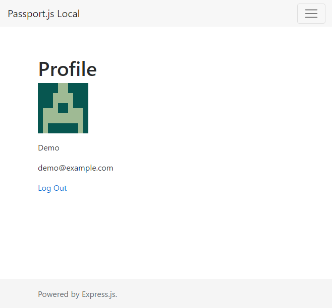

# Passport.js Local Strategy

Demonstration the Passport.js' local strategy utilizing Express.js, MongoDB via Mongoose, Bootstrap v4.0.0-alpha.6 and LESS. Includes a registration strategy.

## Preview

## Instructions

* Install Node.js 6.10.1.
* Install MongoDB locally.
* Start the MongoDB daemon service.
* Run `npm start`.
* Go to http://localhost:3000/.